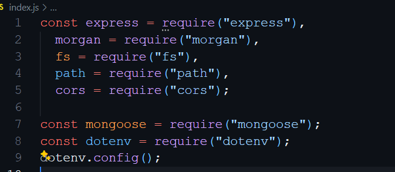

# Movies Oasis API

**Project Owner:** *Emmanuel Nodolomwanyi*

This API will provide its users with new and older movies on the movie chats. The API is a RestAPI architecture design with various endpoints for getting list of all movies, genre, info about movie director. It also has enpionts for ``CRUD`` actions pertaining to users of the app which develpoer will need in the frontend to design user reqistration, allowing user to add favorite movies collections to thier favorite movie array, edit user details and unregistering users. Data are stored in MongoDB, this means you have to work with just two collections namely ``movies collection`` and ``users collcetion`` in a database called ``movieDB``.

Below, I've included how you can install and use this API including examples of request and response types.

- See documentation: [Documentation](https://movie-api-h54p.onrender.com/documentation.html)
- Checkout the API live [follow link](https://movie-api-h54p.onrender.com/documentation.html)

- Copy to clone this repository: <https://github.com/NodEm9/movie_api.git>

## Tech Stack

- [Node.js](https://nodejs.org/en)
- [Express](https://expressjs.com/)
- [MongoDB](https://www.mongodb.com/)

### Example Usage

The API assumes that you have Node.js installed on your OS already for it to work, if not you can download [Node.js](https://nodejs.org/en) here. Be sure to download the one with ``(LTS)`` which stands for ``Long Term Support``. After downloading, click on the installer and follow the instructuions to install Node.js on your computer.

**For** quick start go ahead and clone the repository with the link above or copy it directly from the code section in the project GitHub repository or fork the repository and on your terminal use the ``git clone`` command alone with the copied repository link to clone the project, after that run ``npm install`` to install all the dependencies into your project.

**Note:** ``If you decide to set up your project differently by starting from scratch but only want to use this API as a guide, you can skip this installation tutorial``.

You will need dependencies to make this project work like ``Passport.js``, ``JSON web token (JWT)`` and a host of other. You will be building your own project so you could ass as many as more depencies as you want but what you will need for this API to work are already in the package.json file.

#### index.js**

Create an index.js file where the server will be located and add this code as shown blow.  
  
After that, you can create and enpoint and then add listern with a console log that will print on the console when the server is connected and running sucessfully or return an error if something is properly set up.  
Now you can go to the package.json file and add a script you can use in the terminal to run the program locally.

If you use a mockup movie data, after starting the server, if you go to ``localhost:8080`` on your browser you should see a list of movies displayed on your screen.

### Request Types for Movies

There is basically one HTTP request type for movies.

- **GET Requests/Endpoints:**
  - '/movies' ``Returns all movies in the list``
  - '/movies/:title' ``Returns a single movie``
  - '/movies/genre/generName' ``Returns a specific Genre details by genre name``
  - '/movies/director/directorName'  ``Returns a specific Director details by name.`` .

#### Example JSON GET movies return type

<blockquote>
<pre>
[ {
    _id: ObjectId('665193d02ccaed80dfcdce01'),
    Title: 'The Shawshank Redemption',
    Description: 'Over the course of several years, two convicts form a friendship, seeking consolation and, eventually, redemption through basic compassion, decency, and hope. The Shawshank Redemption is a 1994 American drama film written and directed by Frank Darabont, based on the 1982 Stephen King novella Rita Hayworth and Shawshank Redemption..',
    Director: {
      name: 'Frank Darabont',
      birthyear: '28 January 1959',
      deathyear: 'N/A',
      bio: 'Frank Darabont is a Hungarian-American film director, screenwriter and producer who has been nominated for three Academy Awards and a Golden Globe Award. He is best known for his film adaptations of Stephen King novels such as The Shawshank Redemption (1994), The Green Mile (1999), and The Mist (2007).'
    },
    Genre: {
      name: 'Drama',
      description: [
        'Drama is a category of narrative fiction intended to be more serious than humorous in tone. Drama of this kind is usually qualified with additional terms that specify its particular super-genre, macro-genre, or micro-genre, such as soap opera (operatic drama), police crime drama, political drama, legal drama, historical drama, domestic drama, teen drama, and comedy-drama (dramedy). These terms tend to indicate a particular setting or subject-matter, or else they qualify the otherwise serious tone of a drama with elements that encourage a broader range of moods. The Shawshank Redemption is a 1994 American drama film written and directed by Frank Darabont, based on the 1982 Stephen King novella Rita Hayworth and Shawshank Redemption. It stars Tim Robbins as Andy Dufresne, a banker who is sentenced to life in Shawshank State Penitentiary for.'
      ]
    },
    Actors: [
      {
        name: 'Tim Robbins',
        birthyear: '16 October 1958',
        bio: 'Timothy Francis Robbins is an American actor, screenwriter, director, producer, and musician. He is known for his portrayal of Andy Dufresne in the film The Shawshank Redemption (1994).'
      },
      {
        name: 'Morgan Freeman',
        birthyear: '1 June 1937',
        bio: 'Morgan Freeman is an American actor, director, and narrator. He has appeared in a range of film genres portraying character roles and is particularly known for his distinctive deep voice. Freeman is the recipient of various accolades, including an Academy Award, a Golden Globe Award, and a Screen Actors Guild Award.'
      },
      {
        name: 'Bob Gunton',
        birthyear: '15 November 1945',
        bio: "Robert Patrick Gunton Jr. is an American actor. He is known for playing strict, authoritarian characters, including Warden Samuel Norton in the 1994 prison film The Shawshank Redemption, Chief George Earle in 1993's Demolition. He appeared in the Daredevil series on Netflix as Leland Owlsley and in the film 13 Reasons Why as Todd Crimsen."
      }
    ],
    ReleaseDate: '14 October 1994',
    ImageUrl: 'https://upload.wikimedia.org/wikipedia/en/8/81/ShawshankRedemptionMoviePoster.jpg',
    Rating: 9.3,
    Featured: true
  }]
</pre>

</blockquote>

### Request Type for Users

  The HTTP request type for users include the all major request type for performing CRUD operations. GET, POST, PUT and DELETE.

- **GET Requests/Endpoints:**
  - '/users' ``Returns list of all users in the database.``
  - '/users/:Username' ``Returns a single user by name``.

- **POST Requests/Endpooints:**
  - '/users' ``Add new user to the database``
  - '/users/:Username/movies/:MovieID' ``Add a movie to user's favorite movie list``.

- **PUT Request/Endpoint:**
  - '/users/:Username' ``Update user data``

- **DELETE Requests/Endpoint:**
  - '/users/:Username' ``Remove/delete a user from the database``
  - '/users/:Username/movies/:MovieID' ``Remove a moive from user's favorite movies``.

#### Example JSON POST user return type

 <blockquote>
 <pre>
   [{
      "_id": "66559fdba1850d25a06d10c5",
      "username": "JohnDoe",
      "password": "12345",
      "email": "dojoM@exmaple.com",
      "birthday": "1999-05-20T00:00:00.000Z",
      "role": "Admin",
      "createdAt": "2024-05-28T09:10:46.439Z",
      "favoriteMovies": [],
      "__v": 0
    },
    {
      "_id": "6655c0515fa572e1179e6f37",
      "username": "MaryJack",
      "password": "12345",
      "email": "maryjaneM@exmaple.com",
      "birthday": "1999-05-20T00:00:00.000Z",
      "role": "user",
      "createdAt": "2024-05-28T11:26:44.511Z",
      "favoriteMovies": [],
      "__v": 0
    }]
    </pre>
</blockquote>
