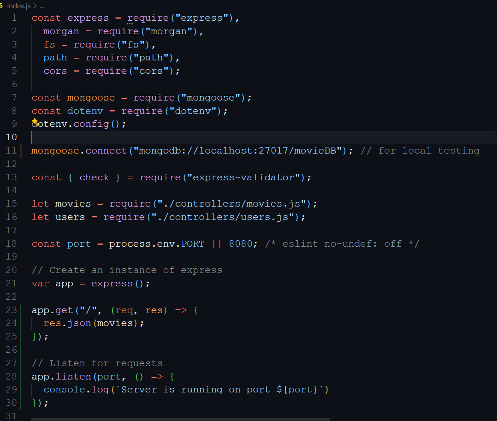

# Movies Oasis API

When used, this API will provide its users with new and older movies on the market. The API is a RestAPI architecture design with various endpoints for getting list of all movies, genre, info about movie director. It also has enpionts for ``CRUD`` actions pertaining to users of the app which develpoer will need in the frontend to design user reqistration, allowing user to add favorite movies collections to thier favorite movie array, edit user details and unregistering users. Data are stored in MongoDB, this means you have to work with just two collections namely ``movies collection`` and ``users collcetion`` in a database called ``movieDB``.

Below, I've included how you can install and use this API including examples of request and response types.
See documentation: [Documentation](https://movie-api-h54p.onrender.com/documentation.html)
Checkout the API live [follow link](https://movie-api-h54p.onrender.com/documentation.html)

Copy to clone this repository: <https://github.com/NodEm9/movie_api.git>

## Tech Stack

- [Node.js](https://nodejs.org/en)
- [Express](https://expressjs.com/)
- [MongoDB](https://www.mongodb.com/)

### Example Usage

The API assumes that you have Node.js installed on your OS already for it to work, if not you can download [Node.js](https://nodejs.org/en) here. Be sure to download the one with ``(LTS)`` which stands for ``Long Term Support``. After downloading, click on the installer and follow the instructuions to install Node.js on your computer.

**For** quick start go ahead and clone the repository with the link above or copy it directly from the code section in the project GitHub repository or fork the repository and on your terminal use the ``git clone`` command alone with the copied repository link to clone the project, after that run ``npm install`` to install all the dependencies into your project.

**Note:** ``If you decide to set up your project differently by starting from scratch but only want to use this API as a guide, you can skip this installation tutorial``.

You will need dependencies to make this project work like ``Passport.js``, ``JSON web token (JWT) `` and a host of other. 
You will be building your own project so you could ass as many as more depencies as you want but what you will need for this API to work are already in the package.json file.

#### index.js**

Create an index.js file where the server will be located and add this code as shown blow.  
  
After that, you can create and enpoint and then add listern with a console log that will print on the console when the server is connected and running sucessfully or return an error if something is properly set up.  
 

Now you can go to the package.json file and add a script you can use in the terminal to run the program locally.

If you user a mockup movies data, after starting the server if you go to the ``localhost:8080`` you should see the list of movies display on the screen.